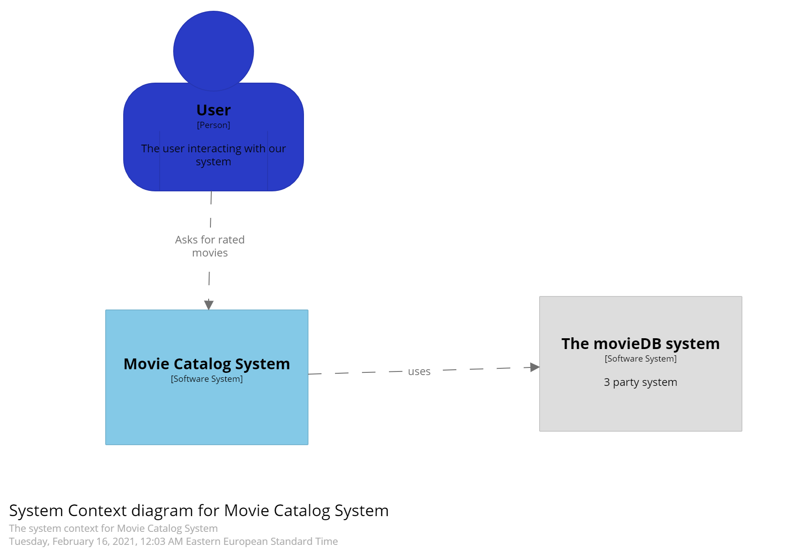
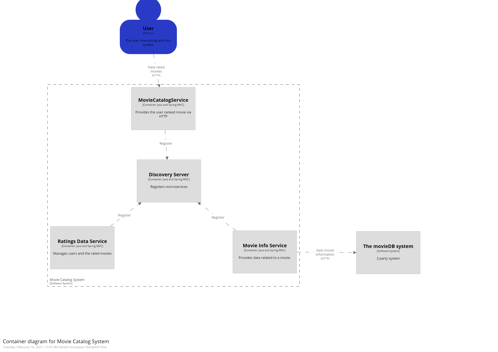
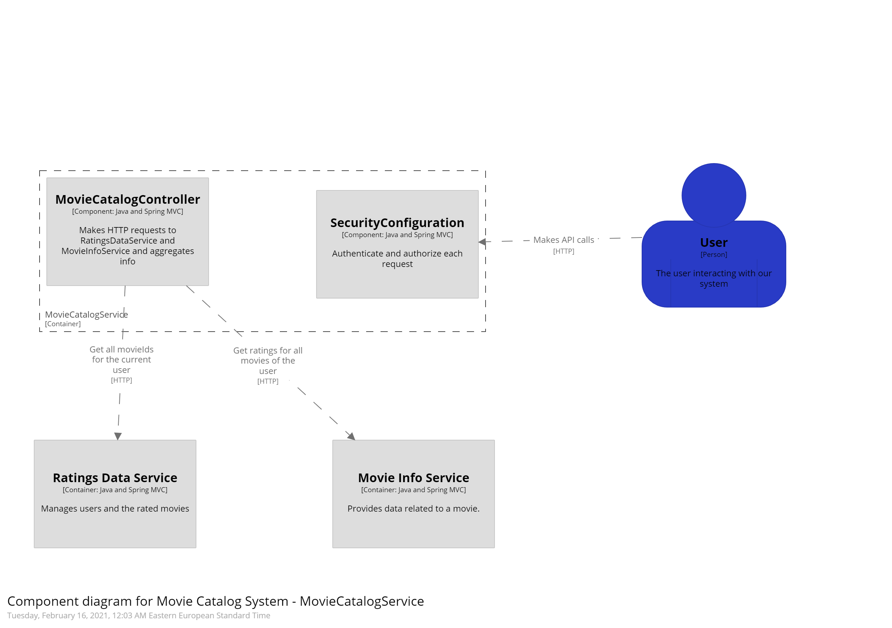

# The Movie Catalog 

The Movie Catalog is a WebApplication that allows a user to rate movies. It uses the following microservices:
- MovieInfoService which provides the data related to a movie making calls to a 3rd party API MovieDB.
- RatingsDataService which manages all users and corresponding movie ratings. 
- MovieCatalogService orchestrates calls to the MovieInfoService and RatingsDataService microservices. 

# Installation
```
run DiscoveryServerEurekaApplication
run RatingsDataServiceApplication
run MovieInfoServiceApplication
run MovieCatalogServiceApplication
```

# Authentication
username: admin, password: admin

# Access
For the rated movies of user1: http://localhost:8084/catalog/user1. For the rated movies of admin: http://localhost:8084/catalog/admin

# Architecture C4 Model

## Context Diagram


## Container Diagram


## Component Diagram

- Focused on the MovieCatalogServiceApplication




## Service-oriented Architecture Patterns
This application is composed of multiple Microservices patterns. As follows:

- Microservice architecture - architect an application as a collection of loosely coupled, services.
- Database per Service - the Movie service has its own private database
- API gateway - a service that provides each client with unified interface to services
- Discovery Server(Eureka) - which allows the micro services to find and communicate with each other without hard-coding hostname and port. It also makes all further requests to any other services through a load-balancing algorithm.
